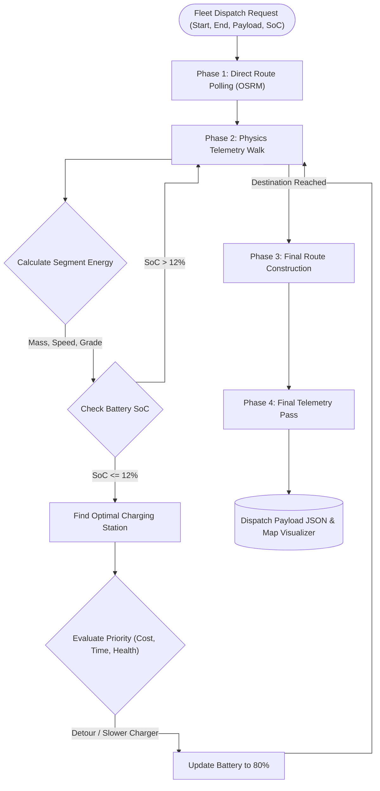

<div align="center">
  <!--  -->
  <h1>RAHI - EV Fleet Routing & Dispatch Engine</h1>
  <p>
    <strong>Physics-Based Multi-Stop EV Charging Optimization for India</strong>
  </p>
  <p>
    <a href="#key-features">Features</a>
    &nbsp;&middot;&nbsp;
    <a href="#architecture">Architecture</a>
    &nbsp;&middot;&nbsp;
    <a href="#tech-stack">Tech Stack</a>
  </p>
</div>

---

## Table of Contents

- [About the Project](#about-the-project)
- [Key Features](#key-features)
- [Tech Stack](#tech-stack)
- [Architecture & Physics Engine](#architecture--physics-engine)
- [Project Structure](#project-structure)
- [Getting Started](#getting-started)

---

## About the Project

**RAHI** (Route Analysis and Haulage Intelligence) is an advanced routing and dispatch platform tailored for commercial Electric Vehicle (EV) fleets in India. Unlike standard routing apps, RAHI uses a deterministic **Physics Engine** to calculate energy consumption (kWh) based on vehicle mass, payload, road grade, and speed. 

It generates multi-stop charging plans across an all-India database of charging hubs, ensuring vehicles reach their destinations without depleting their batteries. The engine dynamically adjusts routes based on fleet goals—whether prioritizing speed, minimizing charging costs, reducing battery degradation, or optimizing for the lowest environmental impact.

---

## Key Features

| Feature | Description |
|---|---|
| **Physics-Based Telemetry** | Calculates exact energy drain (kWh) considering payload limits, grade resistance, and rolling resistance over long-haul routes. |
| **Multi-Stop Charge Planning** | Automatically detects when the State of Charge (SoC) drops below a critical threshold (12%) and routes the vehicle to the nearest optimized charging hub. |
| **Dynamic Goal Optimization** | Adjusts routing and charging station selection based on fleet priorities: **Fastest Transit**, **Lowest Cost**, **Battery Health** (favoring 50kW chargers), or **Lowest Emissions**. |
| **All-India Station Database** | Includes a robust, synthetic database of ~70 charging hubs heavily concentrated in Tier-1 cities and major Indian highway corridors. |
| **Live Route Visualizer** | A premium React/Leaflet dashboard featuring sleek glassmorphism components, dark/light modes, and interactive route mapping. |

---

## Tech Stack

### Backend & Core Logic
| Technology | Purpose |
|---|---|
| **Python (v3.11+)** | Core physics engine and telemetry calculations |
| **FastAPI** | High-performance asynchronous REST API |
| **Uvicorn** | Lightning-fast ASGI web server |
| **OSRM Public API** | Real-world road-following routes and polyline geometries |

### Frontend UI & Dashboard
| Technology | Purpose |
|---|---|
| **React & TypeScript** | Component-based UI and strict type safety |
| **Vite** | Blazing fast frontend build tool |
| **Leaflet & React-Leaflet** | Interactive maps and custom sleek vector markers |
| **CSS3 & Glassmorphism** | Modern, premium aesthetic with smooth micro-animations |

---

## Architecture & Physics Engine

RAHI operates on a strict multi-phase execution model to guarantee that the vehicle completes its journey safely and efficiently.



---

## Project Structure

```text
RAHI-SIH-26/
|-- README.md                 # Project documentation
|
|-- backend/                  # FastAPI Server & Physics Engine
|   |-- main.py               # API endpoints, OSRM routing, and multi-stop logic
|   |-- physics_engine.py     # Kinematics, battery degradation, and queueing theory
|   +-- requirements.txt      # Python dependencies
|
+-- frontend/                 # React UI Dashboard
    |-- src/
    |   |-- App.tsx           # Dashboard layout and state management
    |   |-- index.css         # Glassmorphism design system and priority colors
    |   +-- components/       # MapView, Sidebar, KPI Dashboard, Analytics
    |-- package.json          # Node dependencies
    +-- vite.config.ts        # Vite configuration
```

---

## Getting Started

### Prerequisites
- **Node.js** (v18 or higher)
- **Python** (v3.10 or higher)

### Installation & Run

1. **Clone the repository**
   ```bash
   git clone https://github.com/tarunsh07/RAHI-SIH-26.git
   cd RAHI-SIH-26
   ```

2. **Start the Backend**
   ```bash
   cd backend
   pip install -r requirements.txt
   python -m uvicorn main:app --host 127.0.0.1 --port 8000 --reload
   ```

3. **Start the Frontend**
   ```bash
   # In a new terminal
   cd frontend
   npm install
   npm run dev
   ```

4. **Open the Dashboard**
   - Open your browser and navigate to `http://localhost:5173/`

---
